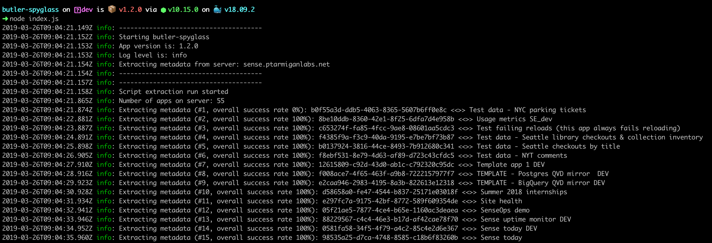

# butler-spyglass

Butler Spyglass is a tool for extracting metadata from Qlik Sense applications.
The tool will extract metadata for all applications in a Qlik Sense environment.

## Why extract app metadata

### Data lineage

When using Sense in enterprise environments, there is often a need to understand both what apps use a certain data source, and what data sources are used by a specific app.

* When de-commissioning an old system that feed several Sense apps with data, it is important to know which these apps are. Butler Spyglass provide this information in the form of data lineage information.

* If a data source contains sensitive information, it is important to always have up-to-date information on what apps use the data source in question.

* Reviewing and auditing apps is greatly simplified if there is clear information on what data sources the app in question uses.

### Load scripts

By storing all app load scripts as individual files on disk, it is possible to snapshot these daily and store them in one ZIP archive for each day. This becomes a historical record of what the scripts looked like in the past.  
Traditional disk backups provide a similar capability to bring back old versions, experience has however proven it to be very valuable to have *quick and easy* access to old script versions, for example if apps have become corrupt or if there is a need to revert back to an earlier app version.

Butler Spyglass solves all the scenarios above by extracting both data lineage information as well as full load scripts for all apps.

## Extracted data

Extracted information for each app is

1. Load script
2. Data lineage, i.e. what data sources are used by the app in question.

### Extracting load scripts

Whether or not to extract app load scripts is controlled by the configuration parameter ```ButlerSpyglass.script.enableScriptExtract```. Set to true/false as needed.

Each app's load script is extracted and stored in a file in a folder as defined by the ```ButlerSpyglass.script.scriptFolder``` configuration parameter.
Each file will be use the app ID as file name.

### Extracting data lineage

Whether or not to extract data lineage info for apps is controlled by the configuration parameter ```ButlerSpyglass.lineage.enableLineageExtract```. Set to true/false as needed.

Data lineage information is stored in a single CSV (```lineage.csv```) file in a folder defined by the ```ButlerSpyglass.lineage.lineageFolder``` configuration parameter.

## Config file

Make a copy of ```./config/production-template.yaml```, call the new file production.yaml. Edit as needed to match your Qlik Sense Enterprise environment.

## Running Butler Spyglass

Once the config file is in place there are several ways to run Butler Spyglass.

## Run from command line

    node index.js

## Run using Docker

Using Docker arguably the easiest way to deploy Butler Spyglass. A few things to keep in mind though:

* The NODE_ENV variable in the ```docker-compose.yml``` file controls what config file will be used. If NODE_ENV is set to *production*, the file ```./config/production.yaml``` will be used.
* The output directories defined in the ```./config/production.yaml``` file must match the volume mapping in the docker-compose.yml file. I.e. if the config file defines the output directories as ```./out/lineage``` ```./myoutdir/script```, the docker-compose file must map the containers /nodeapp/myoutdir to an existing directory on the Docker host:
```./out:/nodeapp/out```.

Looking at the directory structure and the config files, they could look as follows:

*Directory structure*:

    .
    ├── config
    │   ├── certificate
    │   │   ├── client.pem
    │   │   ├── client_key.pem
    │   │   └── root.pem
    │   └── production.yaml
    ├── docker-compose.yml
    └── out
       ├── lineage
       └── script

*config/production.yaml*:

    ---
    ButlerSpyglass:
    # Possible log levels are silly, debug, verbose, info, warn, error
    logLevel: verbose

    # Extract configuration
    extractFrequency: 60000    # milliseconds
    extractItemInterval: 100    # milliseconds

    lineage:
        enableLineageExtract: true
        lineageFolder: ./out/lineage

    script:
        enableScriptExtract: true
        scriptFolder: ./out/script

    configEngine:
        engineVersion: 12.170.2        # Qlik Associative Engine version to use with Enigma.js. ver 12.170.2 works with Feb 2019
        server: sense.ptarmiganlabs.net
        serverPort: 4747
        isSecure: true
        headers:
        X-Qlik-User: UserDirectory=Internal;UserId=sa_repository
        ca: /nodeapp/config/certificate/root.pem
        cert: /nodeapp/config/certificate/client.pem
        key: /nodeapp/config/certificate/client_key.pem
        rejectUnauthorized: false

*docker-compose.yml*:

    version: '3.3'
    services:
    butler-spyglass:
        image: ptarmiganlabs/butler-spyglass:1.0.0
        container_name: butler-spyglass
        restart: always
        volumes:
        # Make config file and output directories are accessible outside of container
        - "./config:/nodeapp/config"
        - "./out:/nodeapp/out"
        environment:
        - "NODE_ENV=production"
        logging:
        driver: json-file

## Sample output

With log level set to VERBOSE set in the config file, output might look like this:


